# OpenController

**A gamepad-controlled interface for Smart Home and Maker applications built with modern Rust**


## What is OpenController?

OpenController started as an exploration into building a unified control interface using a gamepad for various maker and Smart Home protocols. The core idea: why not debug your MQTT infrastructure, control RC vehicles, and interact with different wireless protocols all through the familiar interface of a game controller?

Currently, it's a working proof-of-concept that demonstrates some pretty neat Rust patterns and showcases what's possible when you combine tokio's async runtime with egui's immediate-mode GUI paradigm.

## Current Features

### Multi-Protocol Support
- **MQTT Integration**: Connect to brokers, subscribe to topics, and send messages - great for debugging IoT setups
- **ELRS Control**: Basic support for ExpressLRS RC protocol (early stage)
- **Keyboard Mapping**: Transform controller input into keyboard events with customizable mappings

### Architecture Highlights
- **8 Specialized Threads**: Demonstrates clean separation of concerns in async Rust
- **State Machine Pattern**: Uses the `statum` crate for compile-time guaranteed state transitions
- **Channel-based Communication**: Showcases different tokio synchronization primitives (mpsc, watch, RwLock)
- **Session Management**: Persistent configuration with automatic saving and loading

### UI and UX
- **Immediate-Mode GUI**: Built with egui for responsive, game-like interfaces
- **Dual Input**: Both gamepad and touch/mouse input supported
- **Modular Design**: Clean separation between different protocol handlers

## Technology Stack

This project is essentially a playground for modern Rust async patterns:

```rust
// Core technologies
tokio = "1.43.1"           // Async runtime with excellent channel primitives
eframe = "0.31.1"          // egui integration for immediate-mode GUI
statum = "0.1.48"          // State machines with compile-time guarantees
gilrs = "0.11.0"           // Cross-platform gamepad input
rumqttc = "0.24.0"         // Pure Rust MQTT client
crsf = "2.0.1"             // ELRS/Crossfire protocol implementation
```

## Thread Architecture

Here's the complete picture of how all 8 threads interact with each other:

```mermaid
---
config:
  layout: elk
---
flowchart TB
    %% Main Process
    Main[["main() Thread<br/>(Tokio Runtime)"]]
    
    %% Thread Groups
    subgraph ControllerThreads["Controller Threads"]
        CollectorThread["EventCollector Task<br/>(Gamepad Input)"]
        ProcessorThread["EventProcessor Task<br/>(Event Processing)"]
    end
    
    subgraph MappingThreads["Mapping Threads"]
        ManagerThread["MappingEngine<br/>Manager Task<br/>(Central Management)"]
        
        %% Individual Mapping Engines
        KeyboardThread["Keyboard Mapping Task"]
        ELRSThread["ELRS Mapping Task"]
    end
    
    subgraph MQTTThreads["MQTT Threads"]
        MQTTHandlerThread["MQTT Handler Task<br/>(Connection Management)"]
    end
    
    subgraph PersistenceThreads["Persistence Threads"]
        PersistenceManagerThread["PersistenceManager Task<br/>(Session Management)"]
        AutosaveThread["Autosave Task<br/>(Periodic Saving)"]
    end
    
    subgraph UIThreads["UI Threads"]
        UIThread["UI Thread<br/>(eframe/egui)"]
    end
    
    %% Communication Channels
    %% Controller Channels
    CtrlChannel["ControllerOutput<br/>mpsc-Channel"]
    
    %% Mapping Channels
    UiEventsChannel["UI Events<br/>mpsc-Channel"]
    
    ELRSDataChannel["ELRS Data<br/>mpsc-Channel"]
    
    CustomDataChannel["Custom Data<br/>mpsc-Channel"]
    
    %% MQTT Channels
    MQTTInChannel["MQTT In<br/>mpsc-Channel"]
    
    MQTTOutChannel["MQTT Out<br/>mpsc-Channel"]
    
    MQTTActiveChannel["MQTT Active<br/>watch-Channel"]
    
    %% Persistence Channels
    SessionActionChannel["Session Action<br/>mpsc-Channel"]
    
    %% Connections between Threads and Channels
    Main --> ControllerThreads & MappingThreads & MQTTThreads & PersistenceThreads & UIThreads
    
    CollectorThread --> ProcessorThread
    ProcessorThread --> CtrlChannel
    
    CtrlChannel --> ManagerThread
    
    ManagerThread --> KeyboardThread & ELRSThread
    ManagerThread --> UiEventsChannel & ELRSDataChannel & CustomDataChannel
    
    UiEventsChannel --> UIThread
    
    MQTTHandlerThread <--> MQTTInChannel & MQTTOutChannel
    UIThread <--> MQTTInChannel & MQTTOutChannel
    
    UIThread --> MQTTActiveChannel
    MQTTActiveChannel --> MQTTHandlerThread
    
    UIThread --> SessionActionChannel
    SessionActionChannel --> PersistenceManagerThread
    
    PersistenceManagerThread --> AutosaveThread
    
    %% Startup/Shutdown Explanation
    subgraph StartupFlow["Startup Process"]
        direction TB
        StartMain["main() starts"]
        CreatePersistence["Create<br/>PersistenceManager"]
        CreateControllers["Start Controller<br/>Threads"]
        CreateMappingManager["Create<br/>MappingEngineManager"]
        ActivateMapping["Activate<br/>Mapping Engines"]
        StartMQTT["Start MQTT Thread"]
        StartUI["Start UI"]
        
        StartMain --> CreatePersistence --> CreateControllers --> CreateMappingManager --> ActivateMapping --> StartMQTT --> StartUI
    end
    
    subgraph ShutdownFlow["Shutdown Process"]
        direction TB
        UIExit["UI closes"]
        DropMQTT["MQTT Handle<br/>dropped"]
        DropMapping["Mapping Engines<br/>deactivated"]
        DropController["Controller Handle<br/>dropped"]
        SaveState["Current state<br/>saved"]
        ProgramEnd["Program ends"]
        
        UIExit --> DropMQTT --> DropMapping --> DropController --> SaveState --> ProgramEnd
    end
    
    %% Color Legend
    subgraph ColorCoding["🎨 Color Coding"]
    	direction TB
        LegendUI["● UI Components"]
        LegendController["● Controller Layer"] 
        LegendMapping["● Mapping Engine"]
        LegendMQTT["● MQTT Communication"]
        LegendPersistence["● Data Persistence"]
        LegendMain["● Main Thread"]
        LegendChannel["● Communication Channels"]
    end
    
    %% Thread Explanations
    ShutdownFlow -.-> StartupFlow
    
    %% Class assignments
    class Main main
    class CollectorThread,ProcessorThread controller
    class ManagerThread,KeyboardThread,ELRSThread mapping
    class MQTTHandlerThread mqtt
    class PersistenceManagerThread,AutosaveThread persistence
    class UIThread ui
    class CtrlChannel,UiEventsChannel,ELRSDataChannel,CustomDataChannel,MQTTInChannel,MQTTOutChannel,MQTTActiveChannel,SessionActionChannel channel
    class StartMain,CreatePersistence,CreateControllers,CreateMappingManager,ActivateMapping,StartMQTT,StartUI startup
    class UIExit,DropMQTT,DropMapping,DropController,SaveState,ProgramEnd shutdown
    class LegendUI ui
    class LegendController controller
    class LegendMapping mapping
    class LegendMQTT mqtt
    class LegendPersistence persistence
    class LegendMain main
    class LegendChannel channel
    
    %% Color Definitions
    classDef main fill:#1e1e1e,stroke:#e5dcc8,color:#f7f2e3
    classDef controller fill:#4a6b4a,stroke:#6b8e6b,color:#f7f2e3
    classDef mapping fill:#5c7ba3,stroke:#8cb8e8,color:#f7f2e3
    classDef mqtt fill:#f0c674,stroke:#996633,color:#333
    classDef persistence fill:#5a9a9a,stroke:#8cb8e8,color:#f7f2e3
    classDef ui fill:#d4634a,stroke:#c4766a,color:#f7f2e3
    classDef channel fill:#8a9a8a,stroke:#e5dcc8,color:#f7f2e3
    classDef startup fill:#6a8a6a,stroke:#4a6a4a,color:#f7f2e3
    classDef shutdown fill:#8a6a6a,stroke:#6a4a4a,color:#f7f2e3
    classDef legend fill:#f9f9f9,stroke:#333,color:#333,font-style:italic
    
    linkStyle default stroke:#5e5c64,stroke-width:2px
```



This diagram shows the complete lifecycle of the application, from startup to shutdown, including all communication channels and the specialized responsibilities of each thread. Notice how each thread has a specific domain of responsibility, and communication happens exclusively through typed channels - this is what makes the system both performant and maintainable.

## Installation & Setup

### Prerequisites
- Rust 1.70+ (uses modern async/await patterns)
- A gamepad (Xbox controllers work great via xpad protocol)
- Linux preferred (developed primarily on Raspberry Pi)

### Building
```bash
git clone https://github.com/yourusername/opencontroller.git
cd opencontroller

# Development build with full logging
RUST_LOG=info cargo run

# Release build for performance testing
cargo build --release && ./target/release/opencontroller
```

## Interesting Implementation Details

### Thread Architecture
The application runs 8 specialized threads that demonstrate different async patterns:

1. **Controller Collection** - Raw gamepad input using `gilrs`
2. **Controller Processing** - Event validation and state machine transitions
3. **Mapping Engines** (2x) - Parallel processing for different output protocols
4. **MQTT Handler** - State machine for connection management
5. **UI Thread** - egui immediate-mode rendering
6. **Persistence Worker** - Configuration management with oneshot channels
7. **Auto-save Worker** - Background safety net for configuration

### State Machine Integration
Uses `statum` for compile-time guaranteed state transitions:

```rust
#[state]
enum MappingEngineState {
    Initializing,
    Configured, 
    Active,
    Deactivating,
}

// Transitions are validated at compile time
let engine = engine.initialize()?.configure(strategy)?.activate();
```

### Channel Architecture
Demonstrates different tokio synchronization primitives based on use case:
- `mpsc` for event streams (n:1 communication)
- `watch` for state updates (1:n broadcasting)  
- `RwLock` for shared configuration access
- `oneshot` for request/response patterns

## Current Limitations

This is very much a work-in-progress exploration:

- ELRS integration is basic (proof-of-concept level)
- Error handling varies between modules (still being standardized)
- Some features are mockups in the UI
- Performance optimization is ongoing
- Documentation needs cleanup

## Future Directions

The goal is to expand this into a more comprehensive tool:

- Additional wireless protocols (433MHz, LoRa, etc.)
- Plugin system for extensibility
- Better hardware abstraction
- More sophisticated mapping engines
- Improved error handling and recovery

## Contributing

This project is great for learning modern Rust patterns! Areas where contributions would be valuable:

- **Protocol implementations**: Adding new wireless standards
- **UI improvements**: egui is very flexible for experimentation
- **Performance optimization**: Especially for resource-constrained devices
- **Testing**: Cross-platform validation and edge case handling
- **Documentation**: Examples and tutorials for the patterns used

## Development

```bash
# Run with debug logging
RUST_LOG=debug cargo run

# Check formatting and linting
cargo fmt && cargo clippy

# Run tests
cargo test
```

## License

MIT License - see [LICENSE](LICENSE) for details.

---

**Built with enthusiasm for Rust's async ecosystem and immediate-mode GUIs!**

If you're interested in async Rust patterns, state machines, or building responsive UIs, this project might be worth exploring. The codebase demonstrates several interesting patterns that could be useful in other projects.
